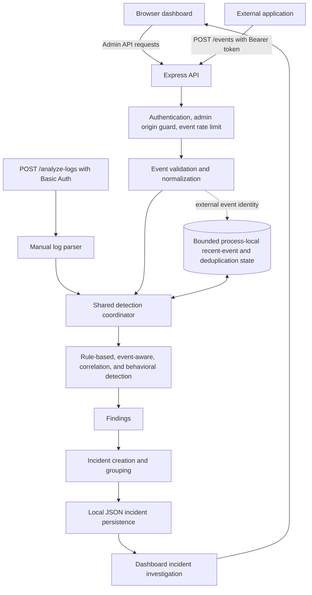

# Security Telemetry & Incident Monitoring

A lightweight Node.js platform that ingests authenticated security events, applies rule-based and behavioral detection, and groups findings into incidents for dashboard investigation.

Applications generate security-relevant events, but raw events alone are difficult to investigate. This project provides a lightweight authenticated event-ingestion API, deterministic detection, finding and incident workflows, and a dashboard for investigation.

## Screenshot / Demo Preview

> **TODO:** Add a current dashboard screenshot here before publishing this README.

## What It Does

An external application sends a security event to the API. The platform validates and normalizes it, runs detection, turns detection results into findings, and creates or updates incidents for investigation.

```text
External application
        |
        v
Authenticated POST /events
        |
        v
Validation and normalization
        |
        v
Detection
        |
        v
Findings
        |
        v
Incident creation or grouping
        |
        v
Investigation dashboard
```

Manual log analysis through `POST /analyze-logs` remains available as a separate testing and debugging workflow.

## Key Features

- Authenticated event ingestion with a separate Bearer token
- Strict event validation and normalization
- Rule-based and event-aware detection, including SQL injection and other configured patterns
- BF_001 brute-force correlation when the required event context is available
- Behavioral request-volume detection for supported HTTP request events
- Optional external event IDs for bounded duplicate and retry handling
- Findings associated with created or updated incidents
- Incident investigation dashboard with search, severity/status filters, sorting, findings, timeline, and supporting context
- Basic Auth for administrative routes and origin protection for state-changing admin requests
- Configurable exact-origin CORS and process-local event rate limiting
- Bounded in-memory event and detector state
- Atomic local JSON incident-file writes within one process
- Graceful handling of `SIGINT` and `SIGTERM`
- Automated tests using Node.js's built-in test runner

## Architecture



The browser dashboard and API are served by the same Express process. Manual log analysis and external event ingestion use the shared detection pipeline. Recent-event correlation, behavioral alert state, and external event identity records are held in bounded process memory.

## Event Ingestion API

### `POST /events`

Send one JSON event per request. The request requires `Authorization: Bearer <EVENT_INGESTION_TOKEN>`. The server validates the event before processing it and assigns its own internal `eventId` (and batch identifier). Do not send credentials in the body, URL, or browser code.

Required fields:

| Field | Type | Description |
| --- | --- | --- |
| `source` | string | Name of the sending application; normalized to `source.service`. |
| `message` | string | Event message used by raw-text detection. |

Optional top-level fields are `timestamp`, `externalEventId`, `clientIp`, `user`, `result`, `http`, `process`, and `destination`. `timestamp`, if supplied, must be ISO-8601 with an explicit timezone. Nested supported fields are:

- `http`: `method`, `url`, `path`, `query`, `userAgent`, `body`
- `process`: `name`, `command`
- `destination`: `ip`, `host`

Unknown fields and invalid values are rejected. String sizes and request-body size are bounded. For example:

```json
{
  "source": "demo-web-app",
  "externalEventId": "demo-request-0001",
  "timestamp": "2026-10-04T10:15:00Z",
  "message": "POST /search",
  "clientIp": "10.10.10.50",
  "http": {
    "method": "POST",
    "path": "/search",
    "body": "username=admin' OR '1'='1",
    "userAgent": "Mozilla/5.0"
  }
}
```

A representative first successful response is `201 Created`:

```json
{
  "accepted": true,
  "eventId": "<server-generated-event-id>",
  "detection": {
    "status": "clean",
    "type": "None",
    "severity": "LOW",
    "matchedRules": []
  },
  "incident": null,
  "duplicate": false
}
```

`detection` describes the analysis; `incident` is `null` when no incident was created, or contains the created/updated incident when findings require one. `duplicate` is included when the request supplies `externalEventId`.

When an external ID is supplied, it is scoped by `source` and compared with the normalized event content:

| Situation | Response |
| --- | --- |
| First successful processing | `201`; includes detection, incident, and `duplicate: false` |
| Same ID and content while processing | `202`; includes `accepted: true`, `processing: true`, and the internal event ID |
| Exact retry after completion | `200`; includes `accepted: true`, `duplicate: true`, and the original internal event ID; detection is not rerun |
| Same scoped ID with different normalized content | `409`; `event_identity_conflict` |
| Validation error | `400`; event is not registered for processing |
| Detection or incident-processing failure | `500`; the identity is marked failed in memory, and a retry with the same ID and content may be processed again |
| Ingestion rate limit exceeded | `429`; includes a `Retry-After` header |

The rate limiter uses a process-local token bucket, defaulting to 120 requests per minute with a burst of 30. Its state resets when the process restarts.

## Detection Pipeline

Detection is deterministic: it applies the rules and thresholds implemented in this repository. It is not machine learning. The coordinator runs raw-text rules, BF_001 correlation, event-aware rules, and behavioral request-volume detection. Representative detections include SQL injection, scanner and open-redirect patterns, brute-force correlation, and high request volume; these are examples, not an exhaustive catalog.

Some rules match event messages as text. Event-aware rules can use supported structured fields. BF_001 requires qualifying failed-authentication event context, a client IP, and event time. The behavioral detector counts supported HTTP request events from the same client IP within a configurable event-time window; its default threshold is 20 requests in 60 seconds. Events without the required structured data do not qualify for these context-dependent detectors.

## Findings and Incidents

- **Event:** an incoming security telemetry record.
- **Finding:** a result produced by a rule, correlation, or behavioral detector.
- **Incident:** a case that groups related findings for investigation and response.

Incidents can include severity, status, finding references, event references, timeline entries, assignment, and an SLA deadline. Findings from one analysis are grouped together. Later findings can attach to an active incident when the event references and time-window conditions match; grouping does not rely on IP address alone.

## Dashboard

The dashboard presents incident totals and severity/status, with client-side search, filtering, and sorting. Selecting an incident opens an investigation drawer with its overview, associated findings, visual timeline, supporting technical context, and admin actions. Incident data refreshes by polling; the dashboard does not use WebSockets or a streaming connection.

## Local Setup

Requirements: Node.js 20 or newer and npm.

1. Clone the repository and enter its directory.
2. Install the locked dependencies:

   ```bash
   npm ci
   ```

3. Copy `.env.example` to `.env` in the repository root (`cp .env.example .env` in macOS/Linux shells, or `Copy-Item .env.example .env` in PowerShell).
4. Set local values for `ADMIN_AUTH_USERNAME`, `ADMIN_AUTH_PASSWORD`, and `EVENT_INGESTION_TOKEN`. For local development, use strong values that are not reused elsewhere. Replace local-only values with properly managed secrets before any non-local deployment.
5. Start the server:

   ```bash
   npm run dev
   ```

6. Open <http://localhost:3001>.

`npm start` runs the application without the development file watcher. If `PORT` is unset or blank, the server listens on port `3001`. It fails to start if the selected port is occupied; it does not choose another port automatically. Admin routes and `POST /events` fail closed when their respective credentials are not configured.

If the browser does not show a Basic Auth prompt when the dashboard first requests admin data, open `http://localhost:3001/dashboard` directly to authenticate, then reload the dashboard.

## Environment Variables

All settings are read from the environment; for local use, the server loads the root `.env` file. Blank optional values use the documented default behavior.

| Variable | Purpose | Example / default | Required? |
| --- | --- | --- | --- |
| `PORT` | Express listening port | `3001` | No |
| `ADMIN_AUTH_USERNAME` | Basic Auth username for admin routes | Set a local username | Yes for admin routes |
| `ADMIN_AUTH_PASSWORD` | Basic Auth password for admin routes | Set a strong local password | Yes for admin routes |
| `EVENT_INGESTION_TOKEN` | Bearer token for `POST /events` | Set a private local token | Yes for event ingestion |
| `PUBLIC_ORIGIN` | Expected browser origin for admin write protection; configure the public HTTPS origin behind a proxy | Unset locally; e.g. `https://monitor.example.com` in deployment | Recommended for HTTPS proxy deployment |
| `CORS_ALLOWED_ORIGINS` | Comma-separated exact origins allowed for cross-origin browser access | Unset for same-origin use | No |
| `INCIDENTS_FILE` | Incident JSON file path; relative paths resolve from the process working directory | Defaults to `backend/incidents.json` | No |
| `EVENT_RATE_LIMIT_PER_MINUTE` | Ingestion token-bucket refill rate; bounded to 1-10,000 | `120` | No |
| `EVENT_RATE_LIMIT_BURST` | Initial and maximum bucket capacity; bounded to 1-10,000 | `30` | No |
| `RECENT_EVENT_MAX_COUNT` | Maximum recent events and dedup entries; bounded to 1-10,000 | `1000` | No |
| `RECENT_EVENT_RETENTION_MS` | Recent-event retention; bounded to 5 minutes to 1 hour | `600000` (10 minutes) | No |
| `BEHAVIOR_REQUEST_THRESHOLD` | HTTP request count that triggers the behavioral detector; bounded to 4-1,000 | `20` | No |
| `BEHAVIOR_REQUEST_WINDOW_SECONDS` | Behavioral event-time window; bounded to 1-240 seconds | `60` | No |

`PUBLIC_ORIGIN` is used by admin origin protection and does not configure CORS. CORS is not required for the same-origin dashboard. Never commit `.env` or put the ingestion token in frontend code.

## Testing

Run the repository's test suite with:

```bash
npm test
```

The suite uses Node's built-in test runner. Tests cover API behavior, authentication and admin origin protection, CORS, event ingestion and rate limiting, normalization-related flows, detection and correlation, behavioral detection, incident grouping and findings, server lifecycle, and frontend rendering. Frontend rendering tests do not constitute full browser end-to-end testing.

## Security Controls

- Basic Auth protects administrative API routes; missing credentials fail closed.
- Event ingestion uses a separate Bearer token; missing configuration fails closed.
- State-changing admin requests receive same-origin protection; `PUBLIC_ORIGIN` supports reverse-proxy HTTPS deployments.
- Optional CORS configuration accepts exact origins; CORS is not authentication.
- Ingestion rate limiting and request/event size bounds limit some accidental or abusive input.
- External event IDs provide bounded, process-local duplicate and retry handling.
- Incident JSON writes use a temporary file and rename, serialized within the single process.
- Request logging records method, path, status, and duration without logging request headers, bodies, or query values.
- The server handles `SIGINT` and `SIGTERM` for graceful HTTP shutdown.
- Secrets belong in private environment or hosting configuration, never frontend code or source control.

These are application controls for a portfolio project, not a security certification or a claim of enterprise-grade protection.

## Deployment Model

The current design is intended for one long-lived Node.js process and one application instance. A deployment needs writable persistent storage for the incident JSON file if incident records must survive replacement of the VM or container. The configured parent directory must already exist.

Terminate HTTPS at a reverse proxy or managed HTTPS edge, keep the Node application port private, configure `PUBLIC_ORIGIN` to the public browser origin, and provide credentials through private host configuration. In-memory recent-event, behavioral, and deduplication state resets on process restart. The repository does not include cloud-provider, container, or orchestration deployment configuration.

## Limitations

These boundaries keep the project understandable and locally runnable:

- Recent-event, brute-force correlation, behavioral alert, and external event deduplication state are bounded and process-local; a restart clears them.
- Deduplication is best-effort. Expiration, capacity eviction, a restart, or another process can make a later retry look new.
- Incident persistence is a local JSON file. Writes are atomic and serialized in one process, but concurrent processes are not coordinated.
- The application requires a single-process, single-instance deployment; the JSON store is not suitable for multiple instances.
- There is no distributed queue, shared cache, or horizontal scaling support.
- Detection is deterministic and limited to the implemented rules and thresholds; it is not ML-based and does not prove that a matched attack succeeded.
- `GET /health` is a liveness endpoint only; it does not check storage readiness.
- The dashboard health score summarizes unresolved incident severity. It is not infrastructure or application health monitoring.

## Demo Flow

A 2-3 minute walkthrough can show:

1. Open the dashboard and select an incident to show its investigation drawer.
2. Send a clean event to `POST /events`.
3. Send an event containing an SQL injection pattern and open the resulting incident.
4. Show its finding and timeline.
5. Show a high-request-volume incident. The repeated request sequence can be scripted instead of entered one event at a time.
6. Replay an event with the same `externalEventId` and content to show duplicate handling.

Use a server-side HTTP client for ingestion and keep the Bearer token private. The dashboard's manual analysis panel is useful for debugging but is not the primary event-ingestion path.

## Why I Built It This Way

The project uses a local-first, single-process design so its event flow and tradeoffs remain easy to run and inspect. Detection uses explicit rules and thresholds so results are explainable. Bounded memory puts a limit on recent-event state. JSON persistence and atomic writes are simple to understand for a portfolio-scale application, while separate admin and ingestion credentials, origin protection, rate limiting, and external event IDs address practical API concerns. These choices also make the boundaries clear: this version favors a small, inspectable system over distributed operation.

## Future Improvements

Possible future work includes durable database storage, shared correlation and deduplication state, distributed ingestion, stronger identity and authorization, richer observability and metrics, cloud deployment configuration, additional detection rules and correlation, and optional AI-assisted investigation or explanation. None of these capabilities are part of the current implementation.
